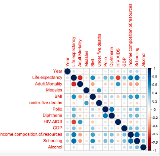
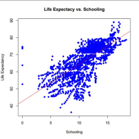
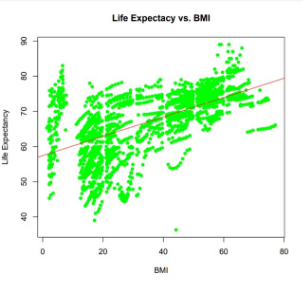
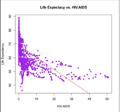
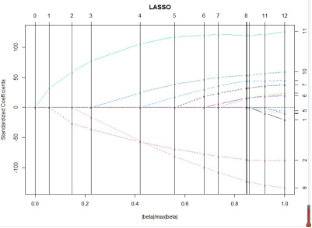
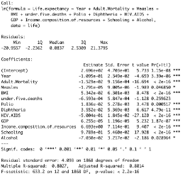
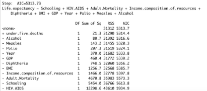

Amanda Yu

Professor McAlinn 

Final Project

STAT 3503

**1. Introduction**

Life expectancy varies across countries and there are predictors of why some counties have a higher life expectancy than others. It is important to find the variables that most influence and predict the life expectancy for a population. Finding these predictors can help develop suitable strategies to improve the quality and performance of health care systems which then increases life expectancy.

This data source we used was obtained from the Global Health Observatory (GHO) data repository under World Health Organization (WHO)​. For this project we decided to analyze developing countries because we felt that it would be less obvious of what the predictors of life expectancy would be than in developed countries. We thought that it was obvious that in developed countries the main predictors of higher life expectancy would be GDP and income. The higher GDP and income the richer the county this would result in higher standards of living, better or effective health systems, and more resources invested into health. 

We thought that it would be less obvious what the predictors of life expectancy for developing countries were without prior knowledge. For our data we looked at only developing countries. For developing countries we hypothesize that schooling and BMI would have the most effect on life expectancy. 

**2. EDA**

`	`To narrow down our predictors we used a correlation plot to find the factors that seem to affect life expectancy the most in developing countries. 

`	`Based on the plot we chose to analyze BMI, HIV/AIDS, and schooling since this plot shows how strong the correlation is based on the colors. At first glance without analysis, looking at the correlation between life expectancy versus schooling, BMI, and HIV/AIDS we see that there seems to be a correlation between these factors. Schooling seems to have the tightest fit.  

**3. Methods**
**
` 	`We used a lasso regression and created a best model using lm for fitting linear models. Lasso regression puts constraints on the size of the coefficients associated with each variable, so the curves in this lasso show the standardized coefficients. The lasso adds bias to estimates and reduces variance to improve prediction which is why we used it here.  From the lasso graph we can see that the predictions 11, 2, and 8, which correspond to Schooling, HIV/AIDs, and adult mortality respectively, seems to be important since it enters the model first, and then has a slow and steady descent to the final value.

`	`We then analyze this further using the best fit model from linear regression. We will look at the AIC after we choose the best model and look at multiple R squared. With AIC, it is a  measure of the relative quality of statistical models for a given data set. It balances the goodness-of-fit of the model with the complexity of the model, which allows for the selection of the model that provides the best compromise between these two aspects. By using the best fit model and the AIC, we can identify the model that provides the best fit to the data while also avoiding overfitting, which can lead to poor performance on new data. R squared shows a measure of the goodness-of-fit of a model. It represents the proportion of the variance in the dependent variable that is explained by the model. 

**5. Results** 

`	`We created a best fit model and from the output we focused on AIC and r squared. The model we selected had the smallest AIC and had an R squared that is above 0.7 meaning it had a high level of correlation. We chose Schooling, HIV/AIDs, and adult mortality as good predictors since they collectively had a large t value and a small p value. These predictors also have the highest coefficients compared to the rest of them. The higher the coefficients are, the more related the pedictores are to the model. 

**6. Discussion** 

`	`Based on our hypothesis and analysis, we do not seem to be far off on believing that schooling and BMI would be a good predictor of life expectancy in developing countries. Schooling is a strong predictor of life expectancy in developing countries. Education can provide greater access to health care and improved living conditions. This can be seen as increasing the number of years of schooling for individuals in developing countries can have a positive impact on their life expectancy because of better opportunities. HIV/AIDS has a negative impact on life expectancy, since it is primarily spread through sexual contact, and it can also be transmitted through contaminated needles and other means. HIV/AIDS can lead to a range of health complications, including opportunistic infections and AIDS-related cancers. Adult mortality is also a significant predictor of life expectancy in developing countries. The higher the adult mortality is, the lower life expectancy gets. 

`	`Schooling, HIV/AIDS, and adult mortality are important predictors of life expectancy in developing countries. Further research is needed to understand the specific mechanisms through which these factors influence life expectancy and to identify effective interventions for improving life expectancy in developing countries.
