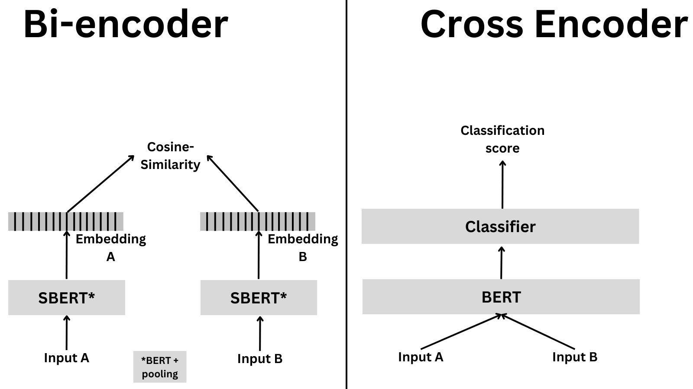
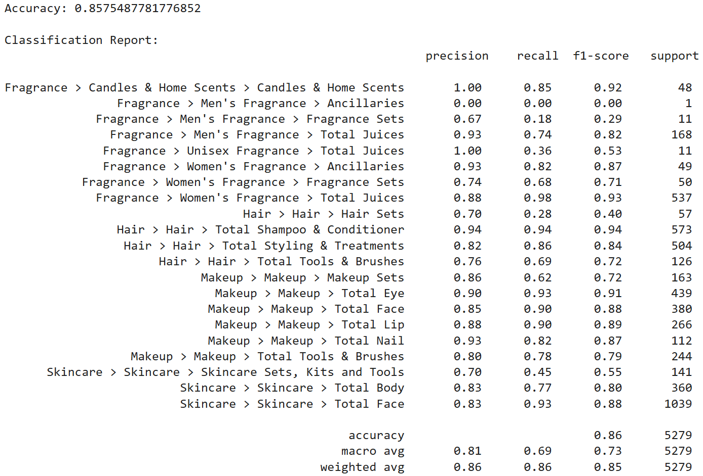
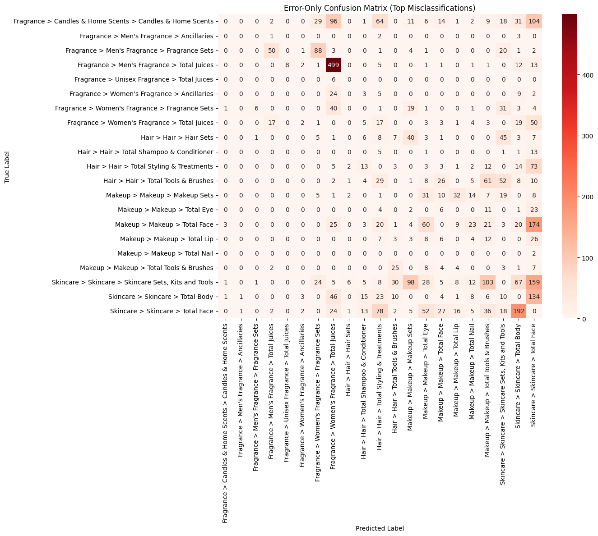
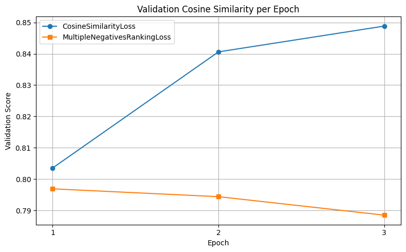
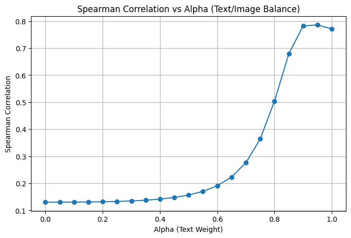

# 

# 

# 

# 

**DS 677: Deep Learning**

Milestone 3

Sentence Transformer: Product Matching

# 

# 

# 

Amanda Yu

Matthew Howarth

8/10/2025

**Table of Contents:**

[**Links 2**](#links)

[**Introduction 3**](#introduction)

> [Statement of Industry Issue 3](#statement-of-industry-issue)
>
> [Dataset (Retailer Files) 3](#dataset-retailer-files)

[**Hugging Face Model: all-MiniLM-L6-V2
4**](#hugging-face-model-all-minilm-l6-v2)

> [Proposed Model 4](#proposed-model)
>
> [Architecture & Review 4](#architecture-review)

[**Demo/Application 5**](#demoapplication)

> [Data Preprocessing (Final_Retailer_Clean_Up)
> 6](#data-preprocessing-final_retailer_clean_up)
>
> [Sentence Transformer - Product Hierarchy
> (Final_Hierarchy_Transformer)
> 6](#sentence-transformer---product-hierarchy-final_hierarchy_transformer)
>
> [Image and Text Embeddings - Product Matching
> 9](#image-and-text-embeddings---product-matching)
>
> [Image & Text embedding
> 10](#image-text-embedding-final_product_matching_with_images)
>
> [Fine tuning + late fusion (Fine-Tuning +Late Fusion Text and Image)
> 10](#fine-tuning-late-fusion-fine-tuning-late-fusion-text-and-image)

[**Forward Discussion 13**](#forward-discussion)

# 

# Links

**Hugging Face**: [[sentence-transformers/all-MiniLM-L6-v2 · Hugging
Face]{.underline}](https://huggingface.co/sentence-transformers/all-MiniLM-L6-v2)

**Project Folder:** [[DS 677 - Sentence Transformer - Google
Drive]{.underline}](https://drive.google.com/drive/u/1/folders/1enGm2GIZUOCEq7bAOZkcaDw4A_leRfwY)

**Link to Demo:**
[[Final_Presentation]{.underline}](https://drive.google.com/file/d/1b24mmKyDKNUUzH5MwdH3cnElaKz54pKs/view?usp=drive_link)

**Colab Links:**

> Rule-Based Logic:
> [[Final_Retailer_Clean_Up]{.underline}](https://colab.research.google.com/drive/13v3rA0cmDa9RWMK2eDDhjMi7raPiYt5N?usp=sharing)
>
> Hierarchy Sentence Transformer:
> [[Final_Hierarchy_Transformer]{.underline}](https://colab.research.google.com/drive/1XsPMS3jpkAiarBvj8KoknndjMpYGVf1I?usp=sharing)
>
> Image and Text Embeddings:
> [[Final_Product_Matching_with_Images]{.underline}](https://colab.research.google.com/drive/1xRFe-AYLz3kVzurhD6C-hcLhf1AehWH5?usp=sharing)
>
> Fine Tuning:
> [[Fine-Tuning]{.underline}](https://colab.research.google.com/drive/18gcnUZM1Lce-jjC7BgOAVN8GZxJKMEdM?usp=share_link)
>
> Late Fusion: [[Late Fusion Text and
> Image]{.underline}](https://colab.research.google.com/drive/1fFWbxkajfkShLkrqbCrhk7YOtUHpnxUX?usp=sharing)

# Introduction 

### Statement of Industry Issue

The following experiments address a current challenge in the growing
e-commerce industry. As the number of e-commerce platforms and product
catalogs continue to grow, intelligent pricing strategies are imperative
for remaining competitive. In the age of information, Millennials, Gen Z
and Gen X are leveraging emerging technologies to stay informed as
consumers. Social media, improved search engines and artificial
intelligence have made it easier than ever before for consumers to stay
knowledgeable about discounts, comparable products and cheaper
alternatives. Many e-commerce companies take a multifaceted approach to
win consumers' business through marketing, consumer intelligence and
pricing strategies.

Pricing strategies can include matching competitor prices, lowest price
guarantees, identifying gaps in product offerings and informed price
changes based on your market or consumer segment. Given the growing size
of the e-commerce industry it can be difficult to process thousands or
millions of different products and utilize this information to make
strategic business decisions. Analyzing these e-commerce datasets come
with challenges of their own. Oftentimes, companies may want to compare
two of the same products from different e-retailers to compare if there
are price differences. Other times, manufacturers may want to ensure
that retailers are adhering to their pricing agreements. This
information can also be leveraged to extract aggregated information such
as average price increase across a specific product segment. However,
all e-retailers are different and product naming conventions may be
different depending on the retailer. They may also segment products
differently based on how their websites are set up.

### Dataset ([[Retailer Files]{.underline}](https://drive.google.com/drive/folders/1XlQOhO2-4qkjEq-cB4hjwUxran0i1wlu?usp=drive_link))

The datasets that we are working with have been extracted from Sephora,
Ulta and Macy's websites. The specific product catalogue for this
exercise is concerned with beauty products. The number of products per
retailer site ranges from 10,000 to 20,000 unique SKUs. In the context
of the industry issue, there are specific products that are offered
across all 3 retailers that are named differently based on the website.
Similarly, each website can utilize a different product hierarchy,
categorizing the product under a different segment depending on the
chosen retailer. [See examples below:]{.underline}
| Product | Sephora | Ulta | Macy’s |
|---------|---------|------|--------|
| *Marc Jacob’s Daisy Eau De Toilette 1.6 oz* | Daisy Eau de Toilette with Wild Berries White Violet Sandalwood Notes | Daisy Eau de Toilette | Daisy Eau de Toilette Spray, 1.6 oz. |

 

| Product | Sephora | Ulta | Macy’s |
|---------|---------|------|--------|
| NARS Pure Radiant Tinted Moisturizer Broad Spectrum SPF 30 | Makeup > Face > Tinted Moisturizer | Home > Skincare > Moisturizer | Beauty > All Makeup |

To make this dataset useful for analysis, we have two goals: to identify
and match identical products across different retailers and standardize
the categorization of similar products based on beauty industry
standards. In the hierarchy example above, the Sephora hierarchy aligns
best with the industry standard.

Each dataset contains the same 25 columns including the following
fields: Item #, Retailer, Brand, Category, Segment, Subsegment, Gender,
Product Name, Fill, Fill_Oz, Fill_ml, Shade Range, Formulation, Finish,
Size, MSRP, Promo Price, Rating, Num of Reviews, Fragrance Family, Key
Notes, Skincare Concerns, Link to Product, Date, and Image URL. In the
hierarchy example for Sephora: the Category is Makeup, Segment is Face,
and Subsegment is Tinted Moisturizer. Some of the columns are specific
to the category or to the retailer's website, therefore, not all columns
are utilized in the experiments. The main columns that we will focus on
are Retailer, Brand, Category, Segment, Subsegment, Gender, Product
Name, Fill, Fill_Oz, Fill_ml, Size, MSRP, Link to Product and Image URL.

# Hugging Face Model: [[all-MiniLM-L6-V2]{.underline}](https://huggingface.co/sentence-transformers/all-MiniLM-L6-v2)

### Proposed Model

Our initial plan for the experiment was to leverage, all-MiniLM-L6-V2, a
sentence transformer model that is fine-tuned, specifically for
sentences or short paragraphs and trained on 1 billion sentence pairs.
The model is able to capture different portions of text and compare
their meaning, enabling comparison between them. Our goal is to create
and engineered key utilizing different features from the retailer
datasets to to accurately identify similar products. The same model
could also be used to learn the relationship between the products and
the beauty hierarchy.

### Architecture & Review

Sentence transformers, also known as SBERT, are able to compute
embeddings and calculate similarity scores using Cross-Encoder models.
all-MiniLM-L6-V2 is a sentence transformer model that, given the input
text, outputs a vector that captures the semantic information. The model
was pretrained on the
[[nreimers/MiniLM-L6-H384-uncased]{.underline}](https://huggingface.co/nreimers/MiniLM-L6-H384-uncased)
model and fine-tuned on a dataset with 1 billion sentence pairs. It was
trained with 100,000 steps, batch size of 1024 and learning rate warmup
of 500/ The sequence length is limited to 128 tokens and they used an
AdamW optimizer with a learning rate of 0.00002. The model was
fine-tuned using a contrastive objective. Given a sentence pair, the
model should be able to predict which sentence was actually paired with
it from their dataset.

The developers of this model intended for it to be used as a sentence or
short paragraph encoder. The model converts the sentences into dense
vector embeddings to capture their meanings. The vectors can be compared
to measure the similarity between the two portions of text. The vectors
can also be used for information retrieval and clustering \[1\]. The
text does not necessarily need to contain the same words, as long it
captures the same meaning. The model focuses on shorter pieces of text,
making it fast and efficient. In comparison to larger models, it is
still capable of delivering highly accurate results.

The figure below illustrates the Cross-Encoder architecture. In this
model, both input sentences are fed together into a single BERT model,
which processes them at the same time and passes the output to a
classifier that produces a similarity or classification score. In
general, this approach achieves higher accuracy than separately encoding
each sentence, although it is more computationally expensive.

{width="2.84375in" height="2.551045494313211in"}

# Demo/Application

As we will demonstrate in the remainder of this report, we found that
all-MiniLM-L6-V2 performed well learning and identifying the product
hierarchy. However, it did not perform as well when trying to match
identical products with different naming conventions. We did find
success in a different approach, leveraging a combination of text and
image embeddings to identify the identical products.

### Data Preprocessing ([[Final_Retailer_Clean_Up]{.underline}](https://colab.research.google.com/drive/13v3rA0cmDa9RWMK2eDDhjMi7raPiYt5N?usp=sharing))

To enable effective product matching and price comparison across
retailers, the Sepora and Ulta product datasets were cleaned and
standardized. Both catalogs were transferred through rule-based logic to
normalize category hierarchies (ex. fragrance, makeup, skincare), align
segment to subsegment labels, and extract key product attributes such as
fill volume, mini/travel sizes, and gift sets. This was done because
each retailer has its own classification, naming connections, and naming
conventions. By resolving these inconsistencies, products can be more
accurately compared across sites, making it possible to evaluate price
differences and identity assortment gaps.

Both Sephora and Ulta product descriptors were parsed to generate
structured fields like 'fill_oz', 'fill_ml', 'Subcategory', and
standardized 'Segment' labels. Duplicate listings were resolved by
generating a unique product key using a combination of brand, product
name, size, and price related attributes. With a more harmonized product
hierarchy it became possible to identify matching SKUs across retailers
despite differences in naming conventions and categorization.
Standardizing the files was a necessary step that improved accuracy and
consistency across both Product Hierarchy and Product Matching models.

### Sentence Transformer - Product Hierarchy ([[Final_Hierarchy_Transformer]{.underline}](https://colab.research.google.com/drive/1XsPMS3jpkAiarBvj8KoknndjMpYGVf1I?usp=sharing))

Using the standardized Sephora and Ulta files, our first experiment
leveraged all-MiniLM-L6-V2 to learn the relationship between the
hierarchy (Category \> Subcategory \> and Segment) and the Product Name.
The standardization step ensured that the same or similar products would
likely have the same hierarchy, regardless of the retailer, for testing
and training due to the rule based logic that was imposed on both files.

After installing the sentence-transformers library, we combined the
Sephora and Ulta dataframes, and filtered out any rows where the
necessary fields were null. Next, we engineered two new columns, 'key'
and 'label', by concatenating the existing fields. 'Key' consisted of
\['Product Name' \| 'MSRP'\] and 'label' consisted of \['Category' \>
'Subcategory' \> 'Segment'\]. The model requires 2 or more samples per
label to learn the relationship, so we filtered out the rare labels
where there was only one key associated. Then we leveraged a stratified
train-test split (80/20) to ensure the same proportion of labels were
preserved in both sets.

Next, we used the sentence transformer library to identify
all-MiniLM-L6-V2 as the model for the experiment. As reviewed earlier,
the sentence transformer converts each key into a dense 384 dimensional
vector embedding. We achieved the highest accuracy using an XGBoost
classifier. Therefore, we needed to convert the string labels into
numeric class labels. Using the sklearn LabelEncoder, each unique label
string was assigned a numeric ID. The XGBoost classifier trained a
gradient-boosted decision tree on the sentence embeddings. The histogram
tree method was used for optimized training, along with running the
model on the GPU. Multiclass log loss was used to measure the training
loss. Lastly, we predicted the labels on the test set and measured
accuracy. Find results below:

The model achieved accuracy of about 86%. It performed very well in
categories such as candles, where the rule-based logic is very clear and
consistent. It also performed well in areas where there were a lot of
samples to learn from such as Fragrance \> Women\'s Fragrance \> Total
Juices or Hair \> Hair \> Total Shampoo & Conditioner. The Segments that
it struggled the most with were mostly concerned with Sets. This is not
surprising, as Sets consist of individual products packaged together,
such as multiple women's fragrances. However, during the data
pre-processing step we did ensure to append the word 'Sets' to the
Product Names if it did not already exist, leading to a small
improvement in accuracy.

To further test the models ability, we then loaded the original,
non-standardized, Macy's file to test how well that model could
categorize products with little-to-no standardization. Unfortunately,
this dataframe did have some items that are not considered beauty
products, such as glasses and books. We developed a quick way of
filtering out non-beauty products, by applying a score to Macy's Product
Names to measure their beauty likelihood.

We started off by creating a token dictionary from the Sephora Brand and
Product Names. We removed any stopwords from the dictionary, counted the
number of times a word appeared in the dictionary, and weighted these
words based on their calculated frequency. The idea behind this was to
weight certain words like Mascara or Estee Lauder higher than other more
ambiguous words within the dataset. We then combined the Macy's Brand
and Product Names into a single key, tokenized them, and compared each
key to the Sephora dictionary. Each product was assigned a heuristic
score based on the likelihood of it being identified as a beauty
product. Products with a higher score will contain frequently used
beauty words. Products with a score lower than 0.001 are filtered of the
dataset as they did not contain beauty words.

Given the performance of the trained model, the only other
standardization performed was to ensure that specific keywords like
'candle', "men's", 'sets', and 'mini' are included in the product name.
Some retailers identify Men's Fragrances by populating 'Men's' in the
'Gender' field, but not the product name. However, the key we used for
the model only contains 'Product Name' and 'MSRP'. To ensure a higher
accuracy, we appended these identified keywords to Product Names that
did not already include them.

After the minimal amount of standardization, the final step was to
predict the labels on the Macy's keys using the learned sentence
transformer model. To check the accuracy, we separately ran the Macy's
file through the rule-based logic and compared the two outputs. When
comparing the rule-based logic labels with the sentence transformer
predicted labels, the model achieved about 70% accuracy. Considering
that we know Macy's is not a beauty-specific retailer and that it has
significantly different naming conventions, we believe that the model
performed better than expected. We also observed examples where the
model may actually be capturing the hierarchy better than the rule-based
logic at times. This is because the rule-based logic processes in a very
specific order based on hard-coded rules, where the sentence transformer
is able to capture the true 'meaning' of the product.

The below confusion matrix details the predicted label (sentence
transformer) vs the true label (rule-based logic) and the count of keys
for each misclassification. The categories that underperformed the most
were Fragrance \> Women's Fragrance \> Total Juices and Skincare \>
Skincare \> Total Body. Given our understanding of the categories,
confusing Face and Body skincare is common for humans and can be
confusing without the correct naming conventions. Similarly, many of the
women's fragrances that were confused with men's included other keywords
such as 'cologne' or 'intense', which many humans would associate with
men's rather than women's.

### Image and Text Embeddings - Product Matching 

#### Image & Text embedding ([[Final_Product_Matching_with_Images]{.underline}](https://colab.research.google.com/drive/1xRFe-AYLz3kVzurhD6C-hcLhf1AehWH5?usp=sharing))

Separate embedding processes for product images and text using CLIP for
images. We used the Image URL field from the files and Python to
download the product images from both Sephora and Ulta, processed them
in batches and extracted 512-dimensional vector embeddings. For text, we
used product identifiers (ex., product titles or keys) to generate
embeddings that captured semantic meaning. These embeddings were then
used to compute cosine similarity between Ulta and Sephora products,
which allowed us to identify top matches. This dual-modality approach,
leveraged both visual and textual features, provided a robust foundation
for product matching, even in cases where one process alone might be
insufficient due to missing or ambiguous data.

#### Fine Tuning & Late Fusion ([[Fine-Tuning]{.underline}](https://colab.research.google.com/drive/18gcnUZM1Lce-jjC7BgOAVN8GZxJKMEdM?usp=share_link) +[[Late Fusion Text and Image]{.underline}](https://colab.research.google.com/drive/1fFWbxkajfkShLkrqbCrhk7YOtUHpnxUX?usp=sharing))

This step we focused on fine-tuning the pretrained language model, to
better capture semantic similarity between product descriptions from
Ulta and Sephora. Since retailers use different naming conventions, a
more robust model was needed to determine when two differently worded
descriptions referred to the same underlying product.

The training process leveraged two distinct loss functions:
CosineSimilarityLoss and Multiple Negatives Ranking Loss (MNRL).
CosineSimilarityLoss was used to directly optimize the cosine similarity
between matched product descriptions. While this loss function performed
well in maximizing similarity scores during validation, it did not align
with the goal of accurate product retrieval as seen in the figure
below**.** However, we selected MNRL to reflect retrieval based
objectives, pulling true product matches closer together in the
embedding space while pushing non-matching pairs apart. This approach
was inspired by prior work \[2\], and has been shown to significantly
improve ranking performance in tasks like paraphrase detection and
product search.

The retrieval evaluation results reinforced the distinction more. The
model trained with MNRL consistently outperformed CosineSimilarityLoss
on key retrieval metrics:

+-----------------------------------------------------------------------+
| CosineSimilarityLoss vs MNRL                                          |
+=======================================================================+
| Accuracy@10 improved from 0.5312 → 0.5874                             |
|                                                                       |
| NDCG@10 rose from 0.2757 → 0.2980                                     |
|                                                                       |
| MRR@10 increased from 0.1929 → 0.2051                                 |
|                                                                       |
| MAP@100 improved from 0.2007 → 0.2180                                 |
+-----------------------------------------------------------------------+

While CosineSimilarityLoss did slightly better at top-1 retrieval
(Accuracy@1: 0.0035 vs. 0.0029), this is a marginal difference,
especially given MNRL's performance across a wider ranking spectrum.
These results confirm that MNRL provides more reliable and retrieval
aligned representations, which are especially useful when businesses
need to identify top-k matches across massive product catalogs.

These results confirm findings from prior research, which emphasizes
that MNRL does better on tasks requiring strong ranking performance,
such as product search and paraphrase detection \[2\]. While
CosineSimilarityLoss seemed to do better based on validation metrics,
MNRL proved to be more effective for real-world product matching
objectives, making it a far more superior approach.

To further enhance product matching accuracy, the fine-tuned
SentenceTransformer model (trained with MNRL) was extended by
incorporating visual signals through late fusion. While text captures
product descriptions, names, and categories, images provide accompanying
semantic cues, especially when Ulta and Sephora have different textual
naming conventions.

The CLIP image embeddings were higher-dimensional than the
SentenceTransformer text embedding. To make them compatible, Principal
Component Analysis (PCA) was used to project these image embeddings into
a 384-dimensional space. PCA preserves the most important components
(those with the highest variance), denoises the embeddings, and avoids
inflating the contribution of the image signal. $$

For late fusion, a weighted combination of the two embeddings was
computed:

$𝐶𝑜𝑚𝑏𝑖𝑛𝑒𝑑\ 𝑒𝑚𝑏𝑒𝑑𝑑𝑖𝑛𝑔 = \alpha \cdot 𝑇𝐸𝑋𝑇 + (1-\alpha)\cdot \text{image}_{PCA}$

Spearman correlation was measured against labeled similarity scores for
various α values. The best result (0.7859) was obtained at α = 0.95,
suggesting that the textual signal carried most of the discriminative
power, and the visual information offered usable complementary cues. The
figure below shows how performance increases as more weight is given to
text, with the best performance at α = 0.85--0.95 range.

The image features were particularly helpful in cases where products
were visually similar and from the same brand, ensuring consistent
visual identity and appearance alone was a strong indicator of match,
such as with identical packaging, bottles, or branded color schemes.

These are the cases where text descriptions may diverge, but visual
signals remain consistent, allowing the image embeddings to improve
recall and ranking accuracy. By blending both approaches, this system
gained a more complete understanding of product similarity, which is an
important advantage for a scalable, cross-retailer comparison.

# Forward Discussion

Overall, we are satisfied with the performance of both models. In the
future, the connection between all of the models will become very
important. We've developed an environment that is capable of identifying
products within a certain industry, assigning them to a specific
category, and identifying identical products offered elsewhere. These
models can be leveraged as powerful tools in a truly intelligent pricing
strategy that removes manual tracking efforts, allows for more analysis
of current market trends and competitive monitoring.

One emerging challenge in the retail industry is the 'grey market' on
e-commerce sites like Amazon. The 'grey market' refers to a
manufacturer\'s products being sold by an unauthorized third party on
platforms such as Amazon. The third party could be selling counterfeit
products or buying discounted products in bulk and undercutting the true
retail price by a small margin to profit. For brands that do not wish to
sell their products on Amazon, it could also be diluting their brand or
adding confusion for their customers. Many brands in these situations
either take legal action or purchase the product to test if it is
counterfeit. Our model could streamline the identification process of
these products being sold by third parties.

From an architectural standpoint, there are some improvements that could
be made. For the hierarchy transformer, the next step would be to
include Subsegment into the model. Unfortunately, during initial
training Subsegment achieved a lower accuracy. This is understandable
because it is much more granular and was likely not captured perfectly
during the rule-based logic. However, we would test a variation of the
model that predicts one level of the category at a time. Therefore,
instead of learning the association of the concatenated label with the
product name it can focus on the different levels separately.

# References:

\[1\] A. Zhang, Z. C. Lipton, M. Li, and A. J. Smola, \*Dive into Deep
Learning\*. Cambridge, U.K.: Cambridge Univ. Press, 2023. \[Online\].
Available: [[https://d2l.ai]{.underline}](https://d2l.ai)

\[2\] Chang, J., & Alate, K. (n.d.). "That was smooth": Exploration of
S-BERT with Multiple Negatives Ranking Loss and Smoothness-Inducing
Regularization.
